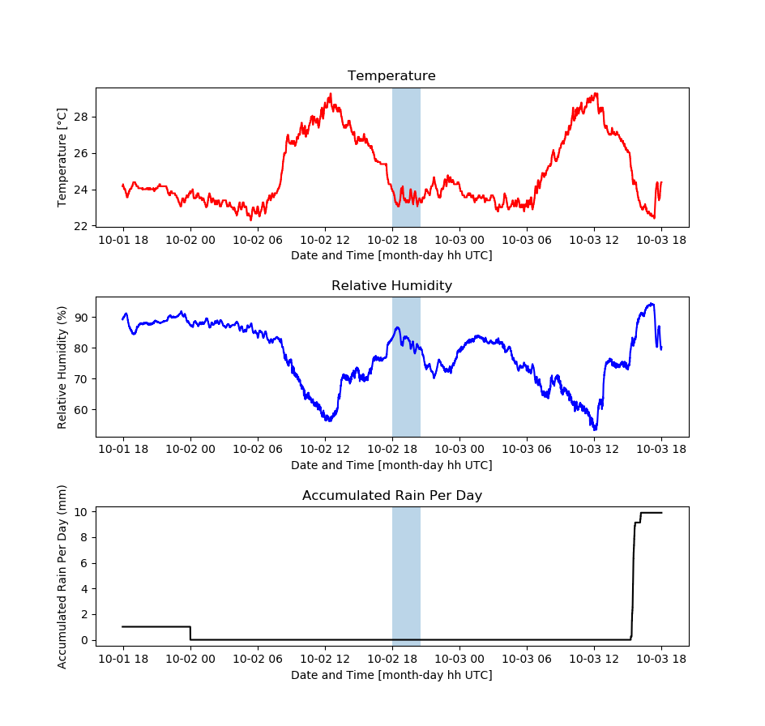

# PHL Weather Reports

The **Weather Reports** will generate temperature, humidity and precipitation readings for the 48-hour window surrounding a given observation date and time, from the weather station files generated at the Observatory. Example weather station files are included here for testing the program. 

An example generated with these files is included below.

